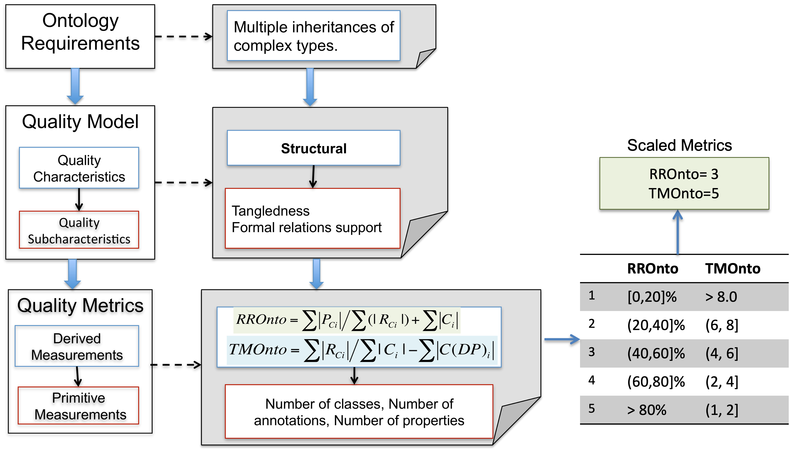

[OQuaRE](README.md)

# OQuaRE Repository

Ontology Quality Requirement and Evaluation Framework (OQuaRE). This repository contains the OQuaRE framework, including definitions of ontology quality characteristics, subcharacteristics, and metrics. The OQuaRE ontology, software resources for OQuaRE, links to related papers, and access to QASAR, the platform for evaluating Semantic Resources, through the usage of OQuaRE and three more ontology quality-related frameworks, namely, OntoEnrich [2], HURON [3] and Evaluome [4].

# OQuaRE Framework

## Table of Contents  
1. [Ontology Quality Evaluation Framework (OQuaRE)](oquare_docs/README.md)  
   - [OQuaRE Quality Model Division](oquare_docs/quality_model.md)  
   - [OQuaRE Quality Metrics Division](oquare_docs/quality_metrics.md)  
   - [OQuaRE Quality Evaluation Division](oquare_docs/quality_evaluation.md)   
2. [OQuaRE Ontology](oquare_Ontology/README.md) 
3. [Software resources](oquare_software_resources/README.md)
    - [GitHub Actions: Ontology Quality Evaluation and Evolution ]
    - [OQuaRE Metrics for an Ontology Corpus]
5. [Publications](oquare_publications.md)
6. [Contact](#contact)   
---

## Ontology Quality Evaluation Framework (OQuaRE)
  
OQuaRE is a systematic framework designed to evaluate the quality of ontologies by adapting the **ISO/IEC 25000:2005 SQuaRE** standard, for Software Product Quality Requirements and Evaluation (SQuaRE). [2]

The **Quality Framework** is organized into five main divisions, as illustrated in the figure. The **OQuaRE Requirements Division** supports the specification of quality requirements. The **OQuaRE Quality Model Division** addresses the internal and external quality of the ontology by defining key characteristics and sub-characteristics. The **OQuaRE Quality Metrics Division** establishes both base and derived measures for quality evaluation. The **OQuaRE Quality Evaluation Division** outlines the processes necessary for conducting quality evaluations. Finally, the **OQuaRE Quality Management Division** focuses on overseeing and managing quality-related activities to ensure continuous improvement and compliance with established standards.

  

## Contact

If there is any issue regarding this Github, please contact me on astrid.duque@um.es, or make an issue in this repository explaining the error. Thank you!

