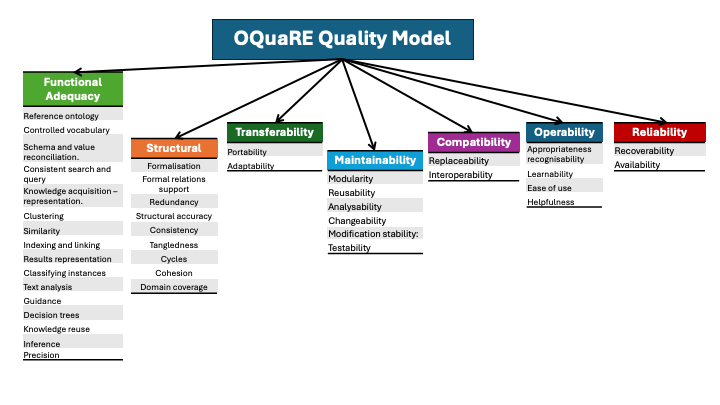

[OQuaRE](../README.md)

## The OQuaRE Quality Model

The current OQuaRE version includes 8 characteristics (7 from SQuaRE and 1 especific for ontologies) and 29 subcharacteristics, the characateriscts from SQuaRE are: 
- Functional adequacy  
- Reliability  
- Operability  
- Maintainability  
- Compatibility  
- Transferability    

The **Structural Characteristic** is introduced to evaluate aspects not covered by SQuaRE, such as consistency, formalization, redundancy, or tangledness. 

The **Functional adequacy** subcharacteristics are the intended uses for ontologies identified in [^1].

  

 
---

### Structural
This category is the only one in this framework that is not specified as such in SQuaRE, but it is important when evaluating ontologies, since it accounts for ontology quality factors such as consistency, formalisation, redundancy or tangledness

| Subcharacteristic      | Definition                                   | Description                                                                                                                                                     | Metrics    |
|------------------------|---------------------------------------------|-----------------------------------------------------------------------------------------------------------------------------------------------------------------|------------|
| **Formalisation**      | Capability of the ontology to support reasoning          |     | -          |
| **Formal relations**   | Capability of the ontology to represent relations supported for formal theories different to the formal support for taxonomy   |                                                                                                            | RROnto     |
| **Redundancy**         | Capability of the ontology to be informative                                                                                                               |    |ANOnto  |
| **Structural accuracy**| Degree of the correctness of the terms used in the ontology            |                                                                | -          |
| **Consistency**        |Degree of the consistency of the ontology                    |                                                                                                        | -          |
| **Tangledness**        | This measures the distribution of multiple parent categories, so that it is related to the existence of multiple inheritance               |                                                                                                                  | TMOnto     |
| **cycles**    | the degree to which a path of relationships forms a closed loop, starting and ending with the same entity (class or individual).        |                                          | -          |
| **Cohesion**           |The degree to which its classes are strongly related and interconnected             |                  | LCOMOnto   |
| **Domain coverage**    | The degree to which The ontology cover the specified domain               | Evaluated by domain experts.                                                                                                                                  | -          |

---

### Functional Adequacy
The capability of the ontologies to provide concrete functions.

| Subcharacteristic            | Definition                                  | Description                                                                                          | Metrics                |
|------------------------------|--------------------------------------------|------------------------------------------------------------------------------------------------------|------------------------|
| **Reference ontology**       |Degree in which the ontology can be used as a reference resource for the particular domain the ontology is built for.       |                                              | -                      |
| **Controlled vocabulary**    | Capability of the ontology to avoid heterogeneity of the terms.              |                                                        | ANOnto                 |
| **Schema/value reconciliation**| Degree in which ontology provide a common data model that can be applied to reconciliation and integration.       |                                            | RROnto, AROnto, Formal degree, consistency degree       |
| **Consistent search/query**  | The degree which the formal model and structure of the ontology provide a semantic context to evaluate which are the data wanted by the users, allowing better querying and searching methods|                                               | ANOnto,RROnto, AROnto, INROnto, Formal degree    |
| **Knowledge acquisition - representation**    | Capability of the Ontology to represent the knowledge acquired.   |                                              |ANOnto, RROnto, NOMOnto     |
| **Clustering**    | Degree in which the annotations of data with respect to ontology terms can be used for clustering such data against the aspects of the ontology.  |                                              |ANOnto    |
| **Similarity**    | Capability of the component of the ontology to be compared for similarity.   |                                              |RROnto, AROnto    |
| **Indexing and linking**    |Degree in which the classes defined in the ontology can act as indexes for quick information retrieval retrieval   |                                              |RROnto, AROnto, INROnto|
| **Results representation**    | Capability of the ontology to analize complex results such as microarrays experiments   |                                              |AROnto, CROnto     |
| **Classifying instances**    | Degree in which ontology Instances can be recognized as member of a certain class  |                                              |     |
| **Text analysis**    | Capability of the structure of the ontology to helps detecting associations between words or concepts and classifying word types.   |                                              |Formal degree     |
| **Guidance**    | Capability of the ontology to guide the specification of domain theories.   |                                              |INROnto, AROnto    |
| **Decision trees**    | Capability of the ontology to be used building Decision trees.   |                                              |INROnto, AROnto, TMOnto|
| **Knowledge reuse**    | The degree to which The ontology knowledge can be used to build other ontologies.   |                                              |ANOnto,AROnto, INROnto, Formal degree, NOMOnto,LCOMOnto, Consistency degree   |
| **Inference**    | The degree to which The formal model of the ontology can be used by reasoners to make implicit knowledge explicit.   |                                              |formal degree, RROnto, CROnto    |
| **Precision**    | The degree to which The ontology provides the right or specified results with the needed degree of accuracy   |                                              |    |

---

### Compatibility

The capability of two or more ontology components to exchange information and/or to perform their required functions while sharing the same hardware or software environment

| Subcharacteristic      | Definition                                  | Description                                                                 | Metrics                |
|------------------------|---------------------------------------------|-----------------------------------------------------------------------------|------------------------|
| **Replaceability**     |The degree to which one ontology can be substituted for another specific ontology for the same purpose and within the same environment, achieving equivalent or acceptable results.  |                     | WMCOnto, DITOnto, NOCOnto, NOMOnto   |
| **Interoperability**   | The degree to which an ontology can effectively combine its knowledge and functionality with one or more other ontologies to achieve a shared goal or perform a combined task.    |                          | -                      |

---

### Transferability

The degree to which the ontology can be transferred from one environment to another

| Subcharacteristic      | Definition                                  | Description                                                                 | Metrics                |
|------------------------|---------------------------------------------|-----------------------------------------------------------------------------|------------------------|
| **Portability**        | The degree in which an Ontology or one part of the ontology can be transferred from one hardware or software environment to another     |                         | -                      |
| **Adaptability**       | The degree to which The ontology can be adapted for different specified environments (languages, expresivity levels) without applying actions or means other than those provided for this purpose for the Ontology considered.      |                         | WMCOnto, DITOnto, RFCOnto, CBOnto      |

---

### Operability
Effort needed for use, and on the individual assessment of such use, by a stated or implied set of users.

| Subcharacteristic      | Definition                                  | Description                                                                 | Metrics                |
|------------------------|---------------------------------------------|-----------------------------------------------------------------------------|------------------------|
| **Appropriateness recognisability**        | The degree to which the Ontology enables users to recognise whether it is appropriate for their needs.                      |              | -                      |
| **Learnability**       | The degree to which the ontology enables users to learn its application.                |                            | WMCOnto, LCOMOnto, RFCOnto, NOMOnto,CBOnto, NOCOnto      |
| **Ease of use**        | The degree to which the ontology makes it easy for users to operate and control it.                      |            | -                      |
| **Helpfulness**        |The degree to which the Ontology provides help when users need assistance.                     |              | -                      |
---

### Maintainability

The capability of ontologies to be modified for changes in environments, in requirements or in functional specifications.

| Subcharacteristic      | Definition                                  | Description                                                                 | Metrics                |
|------------------------|---------------------------------------------|-----------------------------------------------------------------------------|------------------------|
| **Modularity**         | The degree to which the ontology is composed of discrete components such that a change to one component has minimal impact on other components.   |                                 | WMCOnto, CBOnto        |
| **Reusability**        | The degree to which an asset (part of) the ontology can be used in more than one ontology, or in building other assets.            |                             | WMCOnto, CBOnto, DITOnto, NOCOnto, RFCOnto, NOMOnto    |
| **Analysability**        | The degree to which The ontology can be diagnosed for deficiencies or causes of failures (inconsistences), or for the parts to be modified to be identified.           |                            | WMCOnto, LCOMOnto, RFCOnto, NOMOnto,CBOnto, DITOnto      |
| **Changeability**        | The degree to which The Ontology enables a specified modification to be implemented. The ease with which a The ontology can be modified.            |                         | 	WMCOnto, LCOMOnto, RFCOnto, NOMOnto,CBOnto, NOCOnto, DITOnto        |
| **Modification stability**        | The degree to which The ontology can avoid unexpected effects from modifications of the software or knowledge.           |                          | WMCOnto, RFCOnto, NOMOnto,CBOnto, NOCOnto       |
| **Testability**        | The degree to which the ontology modified can be validated.          |                             | WMCOnto, RFCOnto, NOMOnto,CBOnto,DITOnto       |
---

### REFERENCES
[^1]  STEVENS, R. and LORD, P. (2009): Application of ontologies in bioinformatics. In: BERNUS, P., BŁAŻEWICS, J., SCHMIDT, G., SHAW, M., STAAB, S. and STUDER, R. (eds.) Handbook on Ontologies. Springer Berlin Heidelberg.

### Publications

