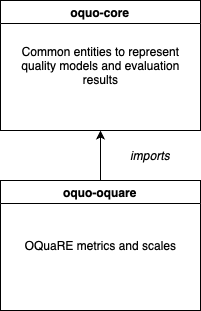
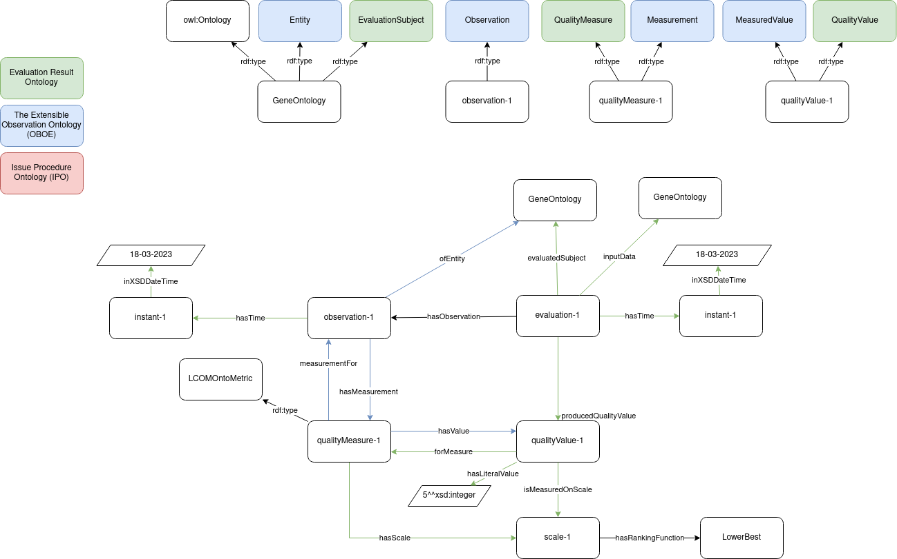

[OQuaRE](../README.md)

## OquaRE Ontology 

OQuare Ontology, named oquo-oquare (https://purl.archive.org/oquo-oquare), provides detailed information about quality metrics and the static scale defined within the OQuaRE framework. The ontology, `oquo-oquare` import the oquo-core, from the **Ontology QUality Ontology (OQUO)**, a modular ontology designed to semantically represent quality models based on OQuaRE Framework[^oquare]. OQUO includes:

- **Metrics**: Semantic definitions for various quality metrics.
- **Characteristics and Subcharacteristics**: To model quality dimensions hierarchically.
- **Entities for Ontology Evaluations**: Concepts and relationships required to evaluate ontologies.

The modular design ensures flexibility, enabling OQUO to support different quality evaluation scenarios. More information about OQUO can be found in the figure below:

 
 The figure below illustrates an example of applying the LCOMOnto metric to the Gene Ontology:
 
 

[^oquare]: [https://www.researchgate.net/publication/285665382_OQuaRE_A_SQuaRE-based_approach_for_evaluating_the_quality_of_ontologies](https://www.researchgate.net/publication/285665382_OQuaRE_A_SQuaRE-based_approach_for_evaluating_the_quality_of_ontologies)